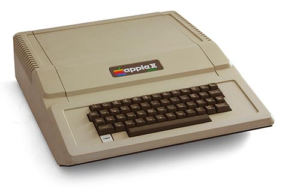

<!DOCTYPE html>
<html>

<head>
	<metacharset="utf-8">
	<title>Apple Macintosh</title>
</head>

<body>
<h4>Flynn's Retro Computers</h4>
<h1>Apple II</h1>

<h5>[Navigation]</h5>
<h5><a href="index.md" > Home</a></h5>
<h5><em>Apple II</em></h5>
<h5><a href="commodore-64.md" > Commodore 64</a></h5>
<h5><a href="trs-80.md" > TRS 80</a></h5>

<h6><em>Apple II. Photo By: Bilby (CC-BY)</em></h6>

The <strong>Apple II</strong> (stylized as <em>Apple ][</em>) is an 8-bit home computer, one of the first highly successful mass-produced microcomputer products, designed primarily by Steve Wozniak. Steve Jobs oversaw the development of the <strong>Apple II's</strong> foam-molded plastic case and Rod Holt developed the switching power supply.

The computer included a MOS Technology 6502 microprocessor running at 1.023 MHz, two game paddles (no longer bundled as of 1980 because they violated FCC regulations), 4 KB of RAM, an audio cassette interface for loading programs and storing data, and the Integer BASIC programming language built into the ROMs. To reflect the computer's color graphics capability, the Apple logo on the casing has rainbow stripes, which remained a part of Apple's corporate logo until early 1998.

<h3>Specifications</h3>
<ul>
	<li><em>Release Date:</em> June 1977</li>
	<li><em>Price:</em> $1,298</li>
	<li><em>Operating System:</em> Integer BASIC</li>
	<li><em>CPU:</em> MOS 6502</li>
	<li><em>Memory:</em> 4KB to 64KB</li>
</ul>
</body>

</html>
